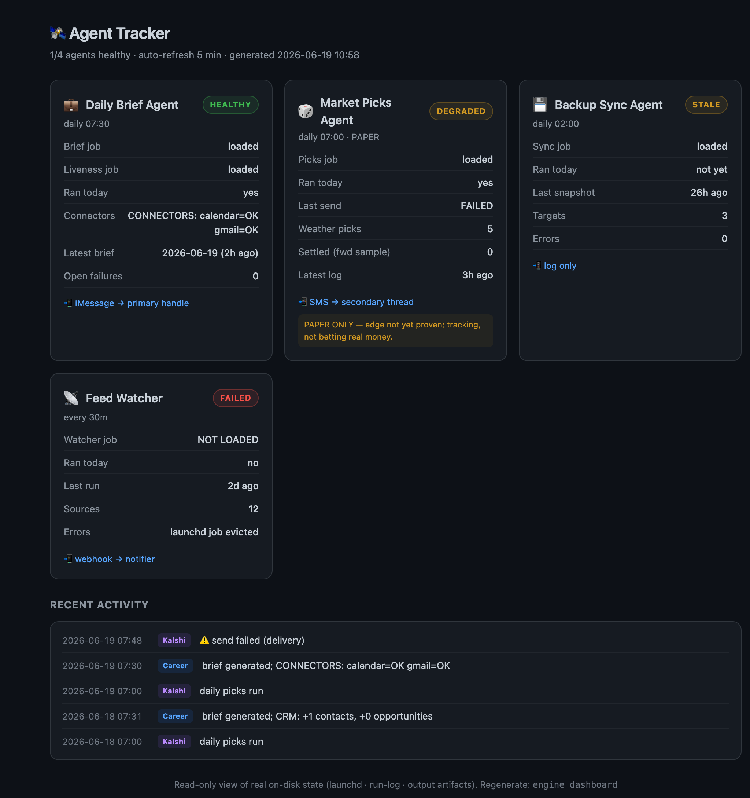

# 🛰️ AgentTracker

A lightweight, dependency-free **visual dashboard for tracking autonomous local agents** — the kind of always-on scripts you schedule with `launchd`/`cron` that quietly do work for you each day.



It reads each agent's **real on-disk state** (scheduler status, run logs, output artifacts) and renders a self-contained dark-theme HTML dashboard. No servers, no frameworks, no network calls — just Python stdlib and a single HTML file you open in a browser.

> *Screenshot above is the `--demo` render (sample data). Your real dashboard never leaves your machine.*

## Why

Background agents fail silently. A cron job that stops firing, a delivery step that no-ops, a connector that goes blind — you don't notice until you needed the output. AgentTracker turns "I hope my agents ran" into a glanceable status board, with honest states derived from ground truth rather than hardcoded green checkmarks.

## What it shows

- **Per-agent status cards** — `HEALTHY` / `STALE` / `DEGRADED` / `FAILED`, each derived from real signals (is the scheduled job loaded? did it run today? did delivery succeed?).
- **Key facts** per agent — last run, freshness, output counts, delivery channel.
- **Merged activity timeline** — recent runs across all agents in one feed.
- **Auto-refresh** every 5 minutes.

## Status model

| State | Meaning |
|-------|---------|
| `HEALTHY` | Scheduled job loaded **and** a clean run recorded today |
| `STALE` | Job loaded but no run yet today (e.g. before its fire time) |
| `DEGRADED` | Ran today but a downstream step (delivery/connector) failed |
| `FAILED` | Job not loaded, or today's run errored / produced nothing |

## Usage

```bash
python3 gen-dashboard.py && open index.html      # render from YOUR agents' real state
python3 gen-dashboard.py --demo --out=demo.html  # render a sample board with fake data
```

📺 **See it without installing anything:** open [`demo.html`](demo.html) (raw HTML, sample data) — or [view it rendered via htmlpreview](https://htmlpreview.github.io/?https://github.com/tarang-tj/AgentTracker/blob/main/demo.html).

The generator (`gen-dashboard.py`) is the whole tool. It ships wired to two example agents (a daily-brief job and a paper-trading picks job) by reading their launchd labels, run-logs, and output files. **Adapt the `*_state()` functions** to point at your own agents' logs and artifacts. The committed `demo.html` is generated with `--demo` (fabricated data) so the live view never exposes real machine state.

## Architecture

Your local agents (launchd/cron jobs) leave **real state on disk** — `launchctl` status, run logs, output artifacts. The generator reads that state (Python stdlib, no network, no mutation), maps it to an honest status model, and renders a self-contained HTML board.

🖼️ **View / edit the diagram:** drag [`assets/architecture.excalidraw`](assets/architecture.excalidraw) onto [excalidraw.com](https://excalidraw.com), or [open the live version](https://excalidraw.com/#json=VXOE40Hn1dspP605XH4Wf,dYVPmvZTMtkwlki97z2vgg).

```
local agents ──▶ on-disk state ──reads──▶ gen-dashboard.py ──▶ index.html (live, git-ignored)
(launchd/cron)   (launchctl,            (status model +        demo.html  (sample, public)
                  logs, artifacts)       HTML render)          + runs at login, refresh 5m
```

## Design principles

1. **Ground truth, not assumptions.** Every field traces to a file or a `launchctl` line. The dashboard's job is to surface real failures, not to look reassuring.
2. **Zero dependencies.** Python stdlib only; the output is one portable HTML file.
3. **Read-only.** It never mutates agent state — it only observes.

## License

MIT
